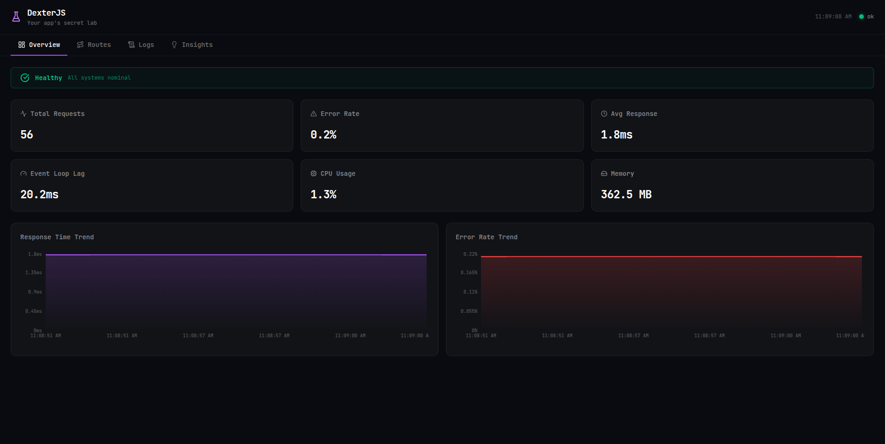
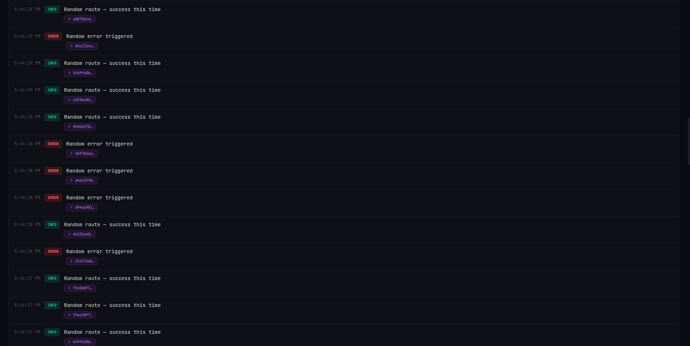
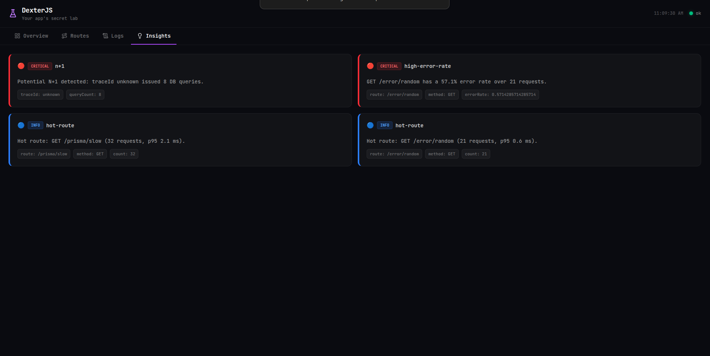

# ⚗ DexterJS

[](https://www.npmjs.com/package/@dexter.js/sdk)
[](https://www.gnu.org/licenses/lgpl-3.0)
[](https://github.com/dexterjs/dexterjs/pulls)

> Your app's secret lab

Zero-config observability for solo Node.js developers. Logs, traces, metrics and a live dashboard — all in one npm install.

## Demo

### Overview


### Logs with Trace Expansion


### Insights — N+1 Detection


> 📸 Demo coming soon — star the repo to get notified

## Why DexterJS?

| Feature | DexterJS | Winston | Pino | Datadog |
|---|---|---|---|---|
| Zero config | ✅ | ❌ | ❌ | ❌ |
| Built-in dashboard | ✅ | ❌ | ❌ | ✅ (paid) |
| Auto instrumentation | ✅ | ❌ | ❌ | ✅ (paid) |
| N+1 detection | ✅ | ❌ | ❌ | ✅ (paid) |
| Trace correlation | ✅ | ❌ | ❌ | ✅ (paid) |
| Local first | ✅ | ✅ | ✅ | ❌ |
| Free | ✅ | ✅ | ✅ | ❌ |
| Solo dev focused | ✅ | ❌ | ❌ | ❌ |

Winston and Pino are great loggers. Datadog is powerful but costs $$$. DexterJS is for the solo developer who wants Datadog-level insights without the Datadog bill.

## Packages

DexterJS is modular, so you can use exactly what you need:

- `@dexter.js/sdk` — everything in one install (recommended)
- `@dexter.js/logger` — standalone logger only
- `@dexter.js/monitor` — monitoring + dashboard only
- `@dexter.js/sidecar` — auto installed, don't import directly

## Quick Start (5 minutes)

### Installation

```bash
npm install @dexter.js/sdk
```

### Pattern 1 — Full setup (recommended)

```ts
import express from 'express'
import { createLogger, monitor, expressMiddleware } from '@dexter.js/sdk'

const app = express()
app.use(expressMiddleware()) // must be first
app.use(express.json())

const logger = createLogger({
  level: 'debug',
  format: 'pretty',
  redact: ['password', 'token']
})

monitor({ app, logger })

// open localhost:4000 for your dashboard
app.listen(3000, () => logger.info('app started', { port: 3000 }))
```

### Pattern 2 — Logger only

```ts
import { createLogger } from '@dexter.js/logger'

const logger = createLogger({
  level: 'info',
  format: 'pretty',
  transport: 'terminal'
})

logger.info('server started', { port: 3000 })
logger.error('something broke', { error: 'boom' })

// child logger with extra context
const reqLogger = logger.child({ requestId: '123', userId: 'abc' })
reqLogger.info('user fetched') // auto includes requestId and userId
```

### Pattern 3 — Monitor only

```ts
import express from 'express'
import { monitor, expressMiddleware } from '@dexter.js/monitor'

const app = express()
app.use(expressMiddleware())
monitor({ app })
```

## Auto Instrumentation

DexterJS supports plug-in style instrumentation for common Node.js tooling:

```ts
import {
  instrumentPg,
  instrumentPrisma,
  instrumentMongoose,
  instrumentRedis,
  instrumentDrizzle,
  instrumentHttp
} from '@dexter.js/sdk'

// wrap before use
instrumentPg(Pool)
instrumentMongoose(mongoose)
instrumentHttp({ axios })

const redis = new Redis()
instrumentRedis(redis)

const prisma = instrumentPrisma(new PrismaClient())
const db = drizzle(instrumentDrizzle(pool))
```

What each captures:

- **Express** — route, method, status, duration, traceId per request
- **pg** — SQL query text (trimmed), duration, traceId
- **Prisma** — model, operation, duration, traceId
- **Drizzle** — query text, duration, traceId
- **Mongoose** — operation, collection/model, duration, traceId
- **Redis** — command + key (example: `GET cached:users`), duration, traceId
- **HTTP (axios/fetch)** — URL/target, duration, traceId, and error info when requests fail

## Logger API

### `LoggerOptions`

| Option | Type | Default | Description |
|---|---|---|---|
| `level` | `debug \| info \| warn \| error \| fatal` | `info` | Minimum log level |
| `format` | `json \| pretty \| minimal` | `pretty` in dev, `json` in prod | Output format |
| `transport` | `auto \| terminal \| file \| both` | `auto` | Where logs go |
| `env` | `development \| production` | auto from `NODE_ENV` | Environment override |
| `redact` | `string[]` | `[]` | Fields to redact, e.g. `['password']` |
| `async` | `boolean` | `true` | Non-blocking buffered writes |
| `bufferSize` | `number` | `100` | Batch size before flush |
| `context` | `Record<string, unknown>` | `{}` | Fields attached to every log |
| `file` | `FileOptions` | `—` | File transport config |

### `FileOptions`

| Option | Type | Description |
|---|---|---|
| `path` | `string` | Log folder path |
| `split` | `boolean` | Split by level into separate files |
| `filenames` | `object` | Custom filenames per level |
| `rotation.maxSize` | `string` | Example: `'10mb'` |
| `rotation.maxFiles` | `number` | Days to keep |
| `rotation.compress` | `boolean` | Gzip rotated files |

### Logger methods

```ts
logger.info(message, metadata?)
logger.error(message, metadata?)
logger.warn(message, metadata?)
logger.debug(message, metadata?)
logger.child(context)                 // create child logger with extra context
logger.flush()                        // flush all buffers
logger.close()                        // close all transports
logger.connectToSidecar(socketPath?)  // connect to monitor pipeline
```

## Monitor API

### `MonitorOptions`

| Option | Type | Default | Description |
|---|---|---|---|
| `app` | `Express app` | required | Express app instance |
| `logger` | `Logger` | `—` | Optional logger instance |
| `port` | `number` | `4000` | Dashboard port |
| `autoSpawn` | `boolean` | `true` | Auto spawn sidecar |
| `socketPath` | `string` | `/tmp/dexter.sock` | Unix socket path |
| `sidecarPath` | `string` | auto-resolved | Custom sidecar entry path |

## Dashboard

Four tabs, all practical, no fluff:

- **Overview** — health status, total requests, error rate, response time, CPU, memory, live charts
- **Routes** — p50/p95/p99 per route, hot routes, error rate per route
- **Logs** — live logs, level filters, searchable metadata, click a `traceId` to inspect spans
- **Insights** — automatic detection of N+1 queries, slow queries, high error rates, hot routes

## Architecture

```text
Your App Process              Sidecar Process
─────────────────             ────────────────────────
  @dexter.js/sdk              collector
  ├── logger            →     aggregator (p50/p95/p99)
  ├── instrumentors   unix    SQLite storage
  └── metrics       socket    REST API (:4000)
                              React Dashboard
```

## Contributing

Contributions are welcome — especially pragmatic ones.

1. Clone the repo
2. `pnpm install`
3. `docker-compose up -d` *(if you have the local compose setup for Postgres/Mongo/Redis)*
4. `cd examples/express-app && pnpm dev`
5. Open `http://localhost:4000`
6. Make changes and submit a PR

What we need help with:

- More instrumentors (MySQL2, BullMQ, Fastify)
- TUI dashboard
- Better N+1 detection
- Performance benchmarks
- Documentation improvements

## Roadmap

- `v0.1.x` — bug fixes, more instrumentors
- `v0.2.0` — hooks, alerts, request/response capture
- `v0.3.0` — TypeScript decorators (`@Trace`, `@Log`)
- `v1.0.0` — stable API, AI-powered analysis

## License

LGPL-3.0 — free to use in any app, even commercial. See `LICENSE_FAQ.md` for plain English explanation.

## Support

- ⭐ Star the repo if DexterJS helps you
- 🐛 Open an issue for bugs
- 💬 Use Discussions for questions
- 💖 Sponsor on GitHub to support development
